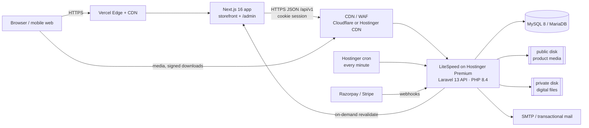
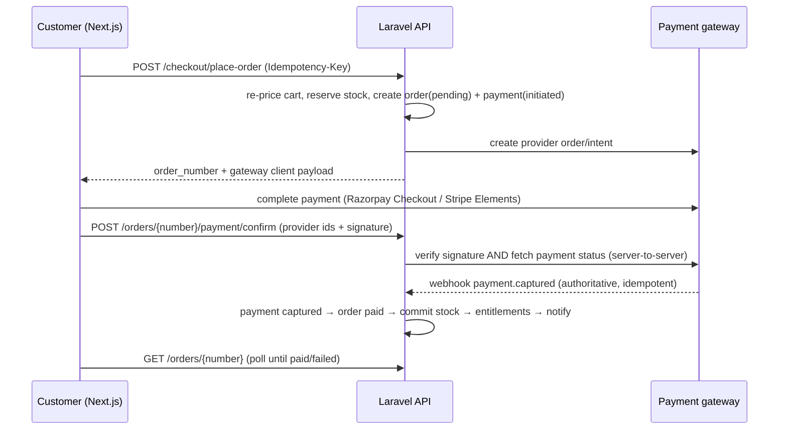
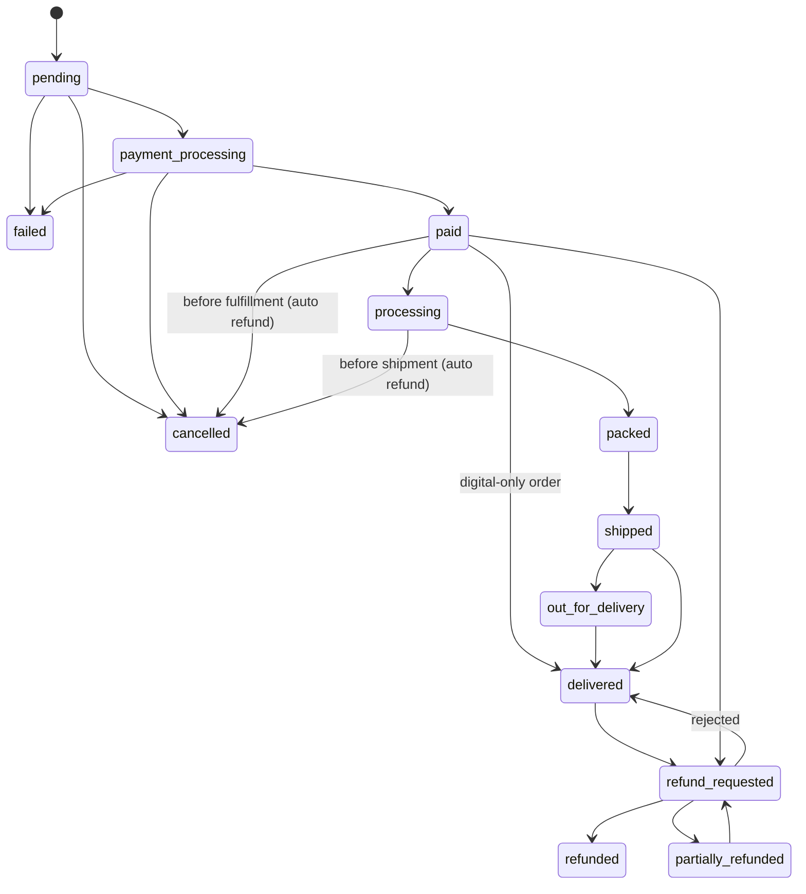

# Architecture

> Status: **Phase 0 — proposed, pending review.** Requirements: [`PRD.md`](PRD.md). Data model: [`DATABASE.md`](DATABASE.md). API: [`API.md`](API.md). Security: [`SECURITY.md`](SECURITY.md).

## 1. Goals and constraints

| Driver | Consequence |
|---|---|
| Physical **and** digital products, more types later (§1, §12) | Generic product engine + per-type strategy classes; no physical-only assumptions (e.g. shipping is optional per item). |
| Hostinger Premium (shared hosting) for backend | No Node.js runtime, no Redis, no Supervisor/daemons, cron-driven background work, LiteSpeed web server, limited CPU/RAM/inodes. |
| Premium, mobile-first, SEO-critical storefront (§51–§58) | Next.js with server rendering + incremental static regeneration, hosted on **Vercel**. |
| Money, inventory, entitlements must be correct (§33–§34, §84, §96) | Server-authoritative pricing, DB transactions with row locks, ledgers, immutable financial records, idempotency everywhere duplicates are possible. |
| Swap providers later (payments, search, storage, mail, carriers) | Every external dependency sits behind an interface + config-driven manager. |

## 2. Decisions & deviations from the PRD

| # | Decision | PRD ref | Reason |
|---|---|---|---|
| D1 | **Frontend on Vercel (Pro plan for production), backend on Hostinger Premium.** | §5, §105 | Premium plan does not run Node.js apps (Node.js is offered on Business/Cloud). Vercel Hobby forbids commercial use, so production needs Pro (~US$20/mo); Hobby is fine for development/previews. |
| D2 | **Admin UI lives in the same Next.js app** under `/admin` (route group `(admin)`), not a separate `admin/` app. | §6 | One build/deploy, shared design system and API client. Admin code is route-split, never shipped to storefront pages, and every admin API call is authorized server-side regardless. |
| D3 | **Every product has ≥ 1 variant.** SKU, price, compare-at price, cost, weight/dimensions and stock live on `product_variants`; a simple product has one *default* variant. | §13, §15 | Removes the "product price vs variant price" duality that causes pricing/inventory bugs. Product-level `base_price`/`stock_quantity` from §13 become **derived** values (min variant price, summed stock) exposed by the API, not stored columns. |
| D4 | **Stock lives in `inventory` + `inventory_transactions`**, not `products.stock_quantity`. | §13, §33 | Ledger is the source of truth (§33); a cached snapshot row per variant makes reads fast. |
| D5 | **RBAC via `spatie/laravel-permission`** with table names configured to the PRD's names (`roles`, `permissions`, `role_permissions`, `user_roles`). | §8, §66 | Mature, well-tested, cached permission checks; avoids hand-rolling. Table names match the PRD exactly. |
| D6 | **Database must work on MySQL 8.0 *and* MariaDB 10.11+.** | §3 | Hostinger shared databases may be MariaDB. We avoid engine-specific features (native UUID type, MySQL-only JSON functions in queries, functional indexes). CI runs both. *Verify the engine/version in hPanel during Phase 1.* |
| D7 | **Error envelope adds `meta.request_id`.** | §69, §87 | Lets a customer quote an ID to support; superset of the PRD format. |
| D8 | **Search v1 = MySQL FULLTEXT + prefix matching + a typo-correction dictionary**, behind a `SearchEngine` interface. | §23 | No search daemon possible on Premium. Typo tolerance is approximate in v1; swap to Meilisearch/Typesense (hosted) when the plan/infra allows. |
| D9 | **Image variants are generated by Laravel at upload time** (WebP, several widths) and served from the API host behind a CDN; Next `<Image>` uses a custom loader, not Vercel's optimizer. | §51 | Avoids Vercel image-optimization quotas/costs and keeps media portable. |
| D10 | **Queue driver = `database`, drained by the scheduler every minute.** | §70, §71 | No long-running workers on shared hosting. Up to ~1 min latency for emails/jobs is acceptable. |
| D11 | **Static CSP header (no nonces) on the storefront**, `script-src 'self' 'unsafe-inline'`. | §63 | Next.js 16 nonce CSP forces dynamic rendering and is incompatible with Cache Components' prerendered static shell. Hash-based SRI (experimental in Next.js) is evaluated in Phase 9. API responses keep a strict `default-src 'none'` CSP. |
| D12 | **shadcn/ui on Base UI primitives** (current shadcn default) instead of Radix. | §3 | Same accessibility goals; Radix is no longer shadcn's default. |
| D13 | **Minimal typed `t()` translator** (`frontend/lib/i18n.ts` + `messages/en.ts`) instead of next-intl for v1. | §83 | Single locale in V1; avoids a dependency. All strings already go through `t()`, so swapping in a library later touches one module. |
| D15 | **Brand palette & type (owner-supplied):** Rich Black `#0A0908`, Dark Sienna `#49111C` (primary), Cultured `#F2F4F3` (background), Grullo `#A9927D`, Umber `#5E503F` (muted text); Cormorant Garamond (display) + Jost (body). Defined once as `--brand-*` tokens in `frontend/app/globals.css` and mapped to semantic tokens. | §54–§55 | Luxury direction chosen by the owner; Phase 2 extends (not replaces) this. |
| D16 | **Preview catalog before Phase 3:** `frontend/features/catalog/` (types mirror API.md §3.3) reads `demo-data.ts` (21 sample products, Pexels images in `public/demo/`). Pages depend only on `catalog.ts`; Phase 3 swaps its internals for API calls and deletes the demo data and images. | §90 | Lets design/UX be reviewed with realistic content; no backend schema is pre-empted. |
| D17 | **Variant option values stored as JSON on the variant** (`{"Size":"M","Colour":"Oat"}`), product option definitions as JSON on the product; no `attributes`/`attribute_values`/`variant_attributes` tables yet. Products carry a single `category_id` (no pivot) in v1. | §15, §66 | Enough for selection, cart and admin; the attribute tables arrive with attribute-based filtering (colour/size facets). |
| D18 | **Payment events are processed synchronously** inside the webhook/confirm request (still deduplicated by `webhook_events (provider, event_id)` and transactional), not via a queued job. | §30, §70 | Shared hosting has no long-running worker; processing is fast and the provider retries on 5xx. A reconciliation job remains planned. |
| D19 | **Test payment gateway** (`TestGateway`) for local/staging: the server plays the provider and produces the same `GatewayEvent` a webhook would. `GatewayManager` refuses it in production. Razorpay activates automatically when its keys are set. | §28 | Lets the full checkout run end to end before payment keys exist, through the real verification code path. |
| D20 | **Admin 2FA is switchable for local development only** (`ADMIN_REQUIRE_2FA=false` in a local `.env`); production always enforces it in code. | §64 | Owner request during development (2026-10-07). |
| D14 | **Account/admin data is fetched client-side** (TanStack Query, cookie session); every route is a prerendered static shell. | §51 | With Cache Components, server-side cookie reads must sit behind Suspense and can't be in the static shell; client fetching keeps pages instant and avoids forwarding cookies through Vercel. |

## 3. System overview



**Domains (same registrable domain is mandatory for cookie auth):**

| Host | Serves |
|---|---|
| `www.<domain>` (apex redirects) | Next.js on Vercel |
| `api.<domain>` | Laravel API, `/storage` media, download streaming, webhooks |
| `cdn.<domain>` (optional) | CDN alias for media if using Cloudflare |

## 4. Technology versions (verified Oct 2026; re-verify at implementation time)

| Layer | Choice |
|---|---|
| Frontend runtime | Node.js 22 LTS (local + Vercel) |
| Frontend | Next.js 16.4 (App Router, Turbopack, Cache Components, Partial Prefetching), React 19.3, TypeScript 5 (strict + `noUncheckedIndexedAccess`), Tailwind CSS v4, shadcn/ui (Base UI primitives), React Hook Form, Zod 4, TanStack Query 5 |
| Backend | Laravel 13.35, PHP 8.4 (8.3 minimum), Laravel Sanctum 4, spatie/laravel-permission 8, `pragmarx/google2fa` (TOTP) + `bacon/bacon-qr-code`, Intervention Image (GD, Phase 3) |
| Database | MySQL 8.0 / MariaDB 10.11+ (InnoDB, utf8mb4) |
| Tests | Pest 5 (backend), Vitest 5 + Testing Library (frontend), Playwright 1.63 + axe-core (E2E/a11y), Lighthouse CI (Phase 10) |
| Local dev | PHP 8.4 + Composer via php.new (`~/.config/herd-lite`), MySQL 8 + Mailpit via Docker (`deployment/local/docker-compose.yml`). Laravel Herd/DBngin also work with no code changes. |

Any package beyond this list needs a one-line justification in the PR (CLAUDE.md rule: no unnecessary dependencies).

## 5. Repository layout (monorepo)

```
E-com/                       # "commerce-platform"
├── CLAUDE.md
├── docs/
├── frontend/                # Next.js (Vercel root directory)
│   ├── app/
│   │   ├── (shop)/          # /, /shop, /category/[slug], /product/[slug], /digital/[slug], /search
│   │   ├── (checkout)/      # /cart, /checkout, /checkout/confirmation/[orderNumber]
│   │   ├── (account)/       # /account, /orders, /orders/[orderNumber], /downloads, /wishlist ...
│   │   ├── (auth)/          # /login, /register, /forgot-password, /reset-password, /verify-email
│   │   ├── (admin)/admin/   # /admin/** (permission-gated layout)
│   │   ├── (content)/       # /pages/[slug], /blog, /blog/[slug], /faq
│   │   └── revalidate/      # on-demand ISR endpoint (secret-protected; not under /api, which is the API host path)
│   ├── components/ui/       # design-system primitives (shadcn-generated, token-driven)
│   ├── components/          # shared composites (ProductCard, CartDrawer, Header, BottomNav)
│   ├── features/<domain>/   # catalog, cart, checkout, account, wishlist, admin/<area> — components+hooks+schemas
│   ├── hooks/
│   ├── lib/                 # money.ts, seo.ts, env.ts (zod-validated), request-id.ts
│   ├── services/            # api-client.ts (envelope-aware), per-domain API modules
│   ├── types/               # API DTO types (mirroring API.md resources)
│   ├── utils/
│   ├── messages/en.ts       # UI strings (D13)
│   └── public/                # design tokens live in app/globals.css (CSS variables + Tailwind @theme)
├── backend/                 # Laravel (Hostinger)
│   ├── app/
│   │   ├── Domain/<Domain>/ # Actions/, Services/, Data/ (DTOs), Enums/, Events/, Exceptions/, Contracts/
│   │   ├── Models/
│   │   ├── Http/
│   │   │   ├── Controllers/Api/V1/{Storefront,Account,Admin}/
│   │   │   ├── Controllers/Webhooks/
│   │   │   ├── Requests/    # FormRequests (validation + authorize())
│   │   │   ├── Resources/   # API Resources (public shape; never expose bigint ids)
│   │   │   └── Middleware/  # AssignRequestId, EnsureAdmin2fa, SecurityHeaders, ...
│   │   ├── Policies/
│   │   ├── Jobs/  Listeners/  Notifications/  Console/
│   │   └── Support/         # Money, ApiResponse, Idempotency, Audit
│   ├── config/  database/{migrations,seeders,factories}/  routes/{api_v1.php,webhooks.php,console.php}
│   └── tests/{Unit,Feature,Api,Security}/
├── tests/e2e/               # Playwright (runs against frontend + backend)
└── deployment/              # deploy scripts, cron snippets, .htaccess, Vercel config, runbooks
```

`database/` from PRD §6 is covered by `backend/database/` (Laravel convention); a top-level copy would drift.

## 6. Backend architecture

### 6.1 Layering
```
Route → Middleware (request id, auth, throttle, 2FA gate)
      → FormRequest (validate + authorize via Policy)
      → Controller (thin: map request → Action, Action result → Resource)
      → Action (one use case, owns the DB transaction, dispatches events)
      → Domain Services (pricing, tax, shipping, inventory, payment gateway, search)
      → Models (Eloquent; no business rules beyond relationships, casts, scopes)
Events → Listeners → queued Jobs / Notifications / Audit
```
Rules: controllers never touch more than one Action; Actions are the only place `DB::transaction()` is opened for business writes; services are stateless and injected via the container.

### 6.2 Domains
`Identity` (users, auth, 2FA, roles), `Catalog`, `Search`, `Inventory`, `Cart`, `Wishlist`, `Pricing` (Money, price resolution), `Tax`, `Shipping`, `Promotions` (coupons + promotions), `Checkout`, `Orders`, `Payments`, `Digital`, `Reviews`, `Support`, `Notifications`, `Cms` (pages, sections, blog, banners, menus, media), `Marketing` (subscribers), `Analytics`, `Audit`, `Settings`.

### 6.3 Product engine
- `products.product_type` enum: `physical | digital | service | subscription | bundle` (only first two enabled in v1; others rejected by validation until implemented).
- `ProductTypeHandler` contract, resolved per type by `ProductTypeRegistry`:
  - `requiresShipping(): bool`, `tracksInventory(): bool`
  - `validateForPublish(Product): ValidationResult` (e.g. digital needs ≥1 active file)
  - `onOrderPaid(OrderItem)` (physical → queue for fulfillment; digital → create `digital_entitlements`)
  - `onRefunded(OrderItem)` (physical → restock per policy; digital → revoke entitlement)
- Mixed carts (physical + digital) are supported: shipping is computed only over items whose handler `requiresShipping()`.

### 6.4 Money & currency (§83–§84)
- All amounts: `BIGINT` minor units + ISO-4217 `currency` code on the owning row. Never floats, never `DECIMAL` for money.
- `App\Support\Money` value object (amount, currency) with add/subtract/multiply-by-int/allocate (for splitting discounts across lines without losing a paisa) and rounding mode **half-up**.
- Store base currency: INR (setting). v1 prices and charges in the store currency only; multi-currency display/charging is V3 (§104) — but nothing assumes INR: currency exponent and symbol come from config, frontend formats with `Intl.NumberFormat`.

### 6.5 Pricing pipeline (server-authoritative)
`CartPricingService::price(Cart): PricedCart` runs every time a cart/checkout is read or changed:
1. Line base price = variant `sale_price` if active sale else `price` (from DB, never from the client).
2. Automatic promotions (Promotions engine).
3. Coupon (validated: dates, limits, per-customer, min order, targets, max discount).
4. Shipping (Shipping engine, physical lines only).
5. Tax (Tax engine; inclusive/exclusive per store setting; per-line, then summed).
6. Totals: `subtotal, discount_total, shipping_total, tax_total, grand_total`.

The same service produces the immutable snapshot written into `orders`/`order_items` at placement. Client-submitted prices are never read.

### 6.6 Tax engine (§31)
- `tax_classes` (e.g. `standard`, `reduced`, `zero`, `digital-goods`), `tax_rates` (name, rate in basis points, compound flag), `tax_rules` (class + country/state match → rate, priority).
- `TaxCalculator` resolves rules by destination (shipping address; billing address for digital-only orders; store address as fallback).
- India GST: intra-state → CGST + SGST rules, inter-state → IGST rule, driven by `settings.store_state` vs destination state. Rates are data, entered by admin. **Rates and inclusive/exclusive pricing must be confirmed by the business's accountant before launch.**

### 6.7 Shipping engine (§32)
- `shipping_zones` (+ `shipping_zone_regions`: country/state/postcode pattern), `shipping_methods` (Standard, Express), `shipping_rates` (method × zone, type `flat | weight_based | price_based | free_over`, ranges, amount), `carriers`, `shipments`, `shipment_items`, `tracking_events`.
- v1: manual carrier + tracking number entry by staff. `CarrierInterface` exists so Shiprocket/Delhivery etc. can be added (V2).

### 6.8 Inventory & reservations (§33–§34)
- `inventory` (one row per tracked variant): `on_hand`, `reserved`; `available = on_hand − reserved` (computed, never stored).
- `inventory_transactions`: append-only ledger (`type`: `opening | received | sale | return | cancellation | adjustment | damage`, signed `quantity`, `reference_type/id`, actor, note). `on_hand` always equals the ledger sum — a nightly `inventory:verify` command reports drift.
- `inventory_reservations`: (`variant_id`, `order_id`, `quantity`, `expires_at`, `status: active | committed | released | expired`).
- **Place order:** in one transaction, `SELECT … FOR UPDATE` the `inventory` rows (ordered by variant id to avoid deadlocks), check `available ≥ qty`, increment `reserved`, insert reservations (TTL 15 min, configurable).
- **Payment captured:** commit reservations → `reserved −= q`, `on_hand −= q`, ledger `sale` rows.
- **Expiry/cancel/fail:** release → `reserved −= q`.
- **Late payment after expiry:** try to re-reserve; if stock is gone, order goes to `paid` + `requires_attention` flag for staff (refund or backorder). Never silently oversell.

### 6.9 Cart (§21)
- `carts` identified by an opaque `token` (UUID) stored in an httpOnly cookie for guests; linked to `user_id` when logged in.
- Merge on login (`MergeGuestCartAction`): for each guest line, add to the user's active cart (sum quantities, cap at available stock and max-per-order), mark guest cart `merged`. Idempotent: a merged cart cannot merge twice.
- "Save for later" = `cart_items.saved_for_later = true` (excluded from pricing).
- Abandoned cart detection: `last_activity_at` + scheduled job marks `abandoned` after N hours (V2 reminders, §72).

### 6.10 Checkout & order lifecycle (§19, §26, §29)
Checkout steps (UI): **Contact → Address → Shipping → Payment** (address/shipping skipped for digital-only carts). Checkout state (email, addresses, shipping method) is stored on the cart; `POST /checkout/place-order` turns it into an order.



The browser `confirm` call only *triggers* a server-side verification with the provider; it is never itself proof of payment.

**Order status** (`orders.status`, PRD §19): `pending → payment_processing → paid → processing → packed → shipped → out_for_delivery → delivered`; side exits `cancelled`, `failed`, `refund_requested → refunded | partially_refunded`.



- Transitions are enforced by `OrderStateMachine` (single place); every transition writes `order_status_history` (from, to, actor, reason) and fires `OrderStatusChanged`.
- **Payment status** (`payments.status`, §29): `initiated, pending, authorized, captured, failed, cancelled, refunded, partially_refunded`; mirrored to `orders.payment_status`.
- **Digital item status** (§19 digital): tracked on `digital_entitlements.status`: `pending → available → downloaded`, exits `refunded`, `revoked`.
- Order number: `ORD-{YYYY}-{000001}` from `order_number_sequences` (row per year, `SELECT … FOR UPDATE` inside the order transaction). Public lookups use `order_number` (+ ownership check); internal FKs use bigint ids; API resources expose `uuid`/`order_number` only.

### 6.11 Payments (§28–§30)
```php
interface PaymentGateway {
  public function key(): string;                                          // 'razorpay'
  public function createPayment(Order $o, Payment $p): GatewayPayload;    // provider order/intent + client payload
  public function verifyClientConfirmation(Payment $p, array $data): bool; // signature check
  public function fetchPaymentStatus(Payment $p): GatewayStatus;           // server-to-server truth
  public function verifyWebhook(Request $r): bool;                         // HMAC/signature
  public function parseWebhook(Request $r): GatewayEvent;                  // normalized: id, type, payment ref, amount
  public function refund(Payment $p, Money $amount, string $reason): GatewayRefund;
}
```
- `PaymentGatewayManager` resolves enabled gateways from `config/payments.php` + admin settings (enabled flag, display order, allowed currencies). Secrets only from env.
- v1 implements **Razorpay** (UPI, cards, net banking). **Stripe** is next (international). PayPal later. A `FakeGateway` exists for tests/local only (refuses to boot when `APP_ENV=production`).
- **Webhooks** `POST /api/webhooks/payment/{provider}`:
  1. Verify signature (reject 401 + log if invalid).
  2. `INSERT webhook_events (provider, event_id UNIQUE, …)`; duplicate key → respond 200, do nothing.
  3. Respond 200 fast; dispatch `ProcessWebhookEvent` job.
  4. Job applies the event through the same `RecordPaymentCaptured` Action used by the confirm path; Actions are idempotent (state checks + unique `payment_transactions.provider_transaction_id`).
  5. Failures → `status=failed`, retried with backoff; `webhook:retry` command; admin view of failed events.
- **Reconciliation job** (every 15 min): payments in `initiated/pending` older than 10 min are checked with `fetchPaymentStatus` — covers webhooks lost on shared hosting.
- Refunds: `RefundOrderAction` (permission `orders.refund`) → gateway refund → `refunds` row + `payment_transactions` row → order/payment status → inventory/entitlement side effects → audit log.

### 6.12 Digital product delivery (§16–§17)
- Files live on the **private** disk (`storage/app/private/digital/{product_uuid}/{file_uuid}`), outside the web root; never in `public/`.
- `digital_products` (per product settings: default `download_limit`, `access_days`, `license_type`), `digital_files` (versions, checksum, size, mime).
- On `paid`: one `digital_entitlements` row per digital order item: `downloads_used`, `download_limit`, `expires_at`, `status`.
- Download flow:
  1. `POST /api/v1/account/downloads/{entitlement}/files/{file}/link` — authenticated user **or** guest with valid order-access token. Checks ownership, order paid, entitlement `available|downloaded`, not expired, `downloads_used < download_limit`, file active.
  2. Server creates `download_tokens` row (random 40-byte token stored hashed, TTL 5 min, single use, bound to entitlement + file + IP prefix hash) and returns `https://api.<domain>/api/v1/downloads/{token}`.
  3. `GET /api/v1/downloads/{token}` re-validates, marks token used, increments `downloads_used` (atomic `UPDATE … WHERE downloads_used < download_limit`), logs `digital_downloads` (ip, user agent, session id, bytes), streams via `BinaryFileResponse` (supports HTTP Range). On LiteSpeed, use `X-LiteSpeed-Location` internal redirect for large files so PHP isn't tied up (verify in Phase 6).
- Revocation (`entitlements.revoke`): status `revoked`, outstanding tokens invalidated.
- Large/high-volume files (video courses, big software) → move to S3-compatible storage (e.g. Cloudflare R2) via the `digital` filesystem disk and presigned URLs (TTL 5 min). Same entitlement logic; only the final step changes.

### 6.13 Search (§23–§25)
- `SearchEngine` contract: `search(SearchQuery): SearchResult`, `suggest(string): array`, `index(Product)`, `remove(Product)`.
- v1 `DatabaseSearchEngine`:
  - `product_search_index` table (product_id, `document` text = name + sku + brand + categories + tags + attribute values + short description) with a FULLTEXT index, rebuilt by a queued job on product change.
  - Query: normalize → boolean-mode FULLTEXT with prefix (`iphon*`) → fallback LIKE on sku.
  - Typo tolerance: `search_terms` dictionary (distinct tokens from the index); if few results, suggest the closest term by Levenshtein distance ≤ 2 (computed in PHP over a cached term list; fine for catalogs up to ~50k terms).
  - Autocomplete: prefix matches on product names + popular `search_queries`.
- Filters (category, brand, price range, rating, availability, product type, attribute values like color/size/material, on-sale) are SQL `WHERE`/`EXISTS` clauses on indexed columns; facet counts computed per request with caching (5 min) for unfiltered category pages.
- Sorting: relevance, newest, price asc/desc, popularity (views 30d), rating, best selling (units 30d), discount %. Popularity/best-selling come from `product_daily_stats`.

### 6.14 Authentication & authorization (§7–§8, §62–§64)
- **Sanctum SPA (cookie) auth**: `api.<domain>` sets session cookie with `Domain=.<domain>`, `Secure`, `HttpOnly`, `SameSite=Lax`; CSRF via `XSRF-TOKEN` cookie + `X-XSRF-TOKEN` header (fetched from `/sanctum/csrf-cookie`). `SANCTUM_STATEFUL_DOMAINS=www.<domain>`.
- Next.js server components that need the user (account/admin pages) forward the incoming `Cookie` header and set `Origin`/`Referer` to the storefront origin when calling the API server-side. Public catalog pages never send cookies (cacheable).
- Session store: `database` (enables "log out all devices" by deleting the user's `sessions` rows + rotating `remember_token`).
- Sanctum personal access tokens are reserved for a future mobile app (§104); not enabled for browsers.
- 2FA: TOTP (+ hashed recovery codes). **Mandatory for any user with an admin permission**; optional for customers. `EnsureAdminTwoFactor` middleware on `/api/v1/admin/*`.
- Authorization: every route has a Policy or explicit `can:` middleware. `Gate::before` grants all abilities only to the `super-admin` role — the single sanctioned role check. Everything else checks permissions (§8).
- Guest order access: on guest checkout, an `order_access_tokens` row (hashed token, expiry 30 days) is created and emailed as a link; it allows viewing that order and its downloads only.

### 6.15 Background jobs & scheduling (§70–§71)
- `QUEUE_CONNECTION=database`, queues: `critical` (payments, webhooks), `default` (notifications, entitlements), `low` (images, search index, reports).
- Hostinger cron (every minute): `php artisan schedule:run`.
- Scheduler entries:

| Schedule | Command / job |
|---|---|
| every minute | `queue:work database --queue=critical,default,low --stop-when-empty --max-time=50 --tries=3` (withoutOverlapping) |
| every 5 min | release expired `inventory_reservations`; expire unpaid orders (`pending` > 60 min → `cancelled`) |
| every 15 min | payment reconciliation |
| hourly | mark abandoned carts; expire download tokens; prune `webhook_events` processed > 90 d (keep failed) |
| daily 02:00 | aggregate `analytics_events` → `product_daily_stats`/`store_daily_stats`; `inventory:verify`; prune expired sessions/tokens; clean temp uploads |
| daily 03:00 | DB backup dump to off-site storage (in addition to Hostinger backups) |
| weekly | `queue:prune-failed --hours=720` |

If the plan's cron minimum interval is > 1 minute, the worker command uses `--max-time` close to that interval. **Verify cron limits in hPanel in Phase 1.**

### 6.16 Notifications & email (§39–§40)
- Laravel Notifications with channels `mail` and `database` (in-app) in v1; `SmsChannel`/`PushChannel`/`WhatsAppChannel` interfaces reserved.
- Template codes (§40) map 1:1 to Notification classes + Markdown mail views: `ORDER_CONFIRMATION, PAYMENT_SUCCESS, ORDER_SHIPPED, ORDER_DELIVERED, DIGITAL_PRODUCT_READY, PASSWORD_RESET, WELCOME, REFUND_COMPLETED`. All queued.
- Mail transport configurable: Hostinger SMTP to start; switch to a transactional provider (Amazon SES / Postmark / Resend) if sending limits or deliverability become a problem.

### 6.17 Caching (§51)
| Layer | What |
|---|---|
| Vercel CDN / Next.js | Catalog, category, product, CMS pages statically rendered with time-based revalidation (e.g. 300 s) **plus** on-demand tag revalidation. Cart/checkout/account/admin are dynamic, never cached. |
| On-demand revalidation | Laravel listener on `ProductUpdated`, `CategoryUpdated`, `PageUpdated`… queues `RevalidateStorefront` job → `POST https://<domain>/revalidate` with HMAC secret + tags (`product:{uuid}`, `category:{uuid}`, `home`). |
| Laravel cache | `CACHE_STORE=database` (no Redis on Premium): settings, permission cache, menus, facet counts, search term list. Keys namespaced and tag-like prefixes invalidated by events. |
| HTTP | Public GET catalog endpoints send `Cache-Control: public, max-age=60, stale-while-revalidate=300` + `ETag`; authenticated endpoints `private, no-store`. |
| Media | Immutable hashed filenames, `Cache-Control: public, max-age=31536000, immutable`, behind CDN. |

### 6.18 Logging, request IDs & audit (§65, §85–§87)
- `AssignRequestId` middleware: accept inbound `X-Request-ID` if it matches `^[A-Za-z0-9-]{8,64}$`, else generate a ULID; `Log::withContext(['request_id'=>…, 'user_id'=>…])`; echo on response header. Next.js generates one per server request and forwards it.
- Log channels (daily rotation, 14–30 day retention): `api`, `auth`, `payments`, `webhooks`, `orders`, `downloads`, `admin`, `errors`.
- A Monolog processor redacts keys matching `password|secret|token|authorization|cookie|card|cvv|otp|api_key` recursively, and payment payloads are stored only in redacted form.
- `audit_logs`: actor_id, actor_type, action (`product.updated`), subject type/id, `before`/`after` JSON (changed fields only), ip, user agent, request_id, created_at. Written by an `Auditable` model trait (for admin-editable models) + explicit `Audit::record()` in sensitive Actions (refunds, role changes, settings, entitlement revocation, 2FA reset). Append-only (no update/delete routes; DB user permissions can't be split on shared hosting, so enforced at app level + covered by tests).
- Exception handler: API returns `{"success":false,"message":"Something went wrong. Please try again.","errors":{},"meta":{"request_id":"…"}}` for 500s; full exception logged with request id, user id, route, method.

### 6.19 Media & CMS (§46–§48)
- `media_assets` library (disk, path, mime, size, width/height, alt text, title, folder, uploaded_by). Uploads validated by MIME sniffing + extension allow-list + size limit; images re-encoded (strips EXIF/scripts) to WebP variants (320/640/960/1440/2048 widths) by a queued job.
- `product_media` references `media_assets`.
- CMS: `pages` + ordered `page_sections` (type ∈ hero, product_grid, product_carousel, category_grid, banner, text, image, video, testimonials, faq, newsletter; `settings` JSON validated per type by a section schema class; `is_visible`, `sort_order`). The homepage is a page with slug `home`. Rich text is stored as sanitized HTML (server-side HTML purifier allow-list).
- `blog_posts`, `banners`, `menus`/`menu_items`, `faqs`.

### 6.20 Analytics (§73–§75)
- Lightweight first-party events: `analytics_events` (type ∈ `page_view, product_view, add_to_cart, begin_checkout, purchase, wishlist_add, search`; session hash; product id; created_at) written via a throttled beacon endpoint and server-side for purchases. Raw rows pruned after 90 days.
- Nightly aggregation into `product_daily_stats` and `store_daily_stats`; dashboards read aggregates only (fast on shared hosting).
- Visitors/conversion are approximate (cookie-less session hash); optionally pair with a privacy-friendly external analytics tool.

## 7. Frontend architecture

- **Rendering:** Server Components by default. Public pages: static + ISR with fetch tags. Interactive islands (cart drawer, filters, variant picker, gallery) are Client Components. Account/checkout/admin: dynamic rendering, data via TanStack Query hitting the API with credentials.
- **API client** (`services/api-client.ts`): typed `request<T>()` that sends `credentials: 'include'`, `X-Request-ID`, `Accept: application/json`, handles CSRF cookie bootstrap, unwraps the §69 envelope, throws a typed `ApiError` (status, message, field errors, request id). All responses validated with Zod in development; DTO types in `types/`.
- **Forms:** React Hook Form + Zod schemas mirroring backend validation (backend remains authoritative; server field errors map back into the form).
- **State:** server state in TanStack Query; cart count/drawer in a small React context; no global store library.
- **Filters & sorting:** URL search params are the state (shareable, SEO-safe canonical), updated with `router.replace` without full reload (§24).
- **Design system (§54):** tokens in `app/globals.css` (CSS variables for color, radius, fonts; type scale, spacing, shadow and motion tokens added in Phase 2) exposed to Tailwind v4 via `@theme`; shadcn/ui components restyled only through tokens; arbitrary Tailwind values (`[...]`) only inside `components/ui`. Light theme first; dark-ready tokens.
- **Responsive (§52–§53):** mobile-first with Tailwind's layout breakpoints `md 768, lg 1024, xl 1280` (+ `2xl 1440`, `3xl 1920` added in Phase 2). The PRD's phone widths (360/390/430) are fluid, not layout switches, and are covered by Playwright viewports. Bottom nav below 1024 px; touch targets ≥ 44 px (buttons/inputs are 44 px tall on phones, 40 px from `md`).
- **Motion (§56):** CSS transitions + `motion-safe:` variants; no animation library unless a case demands it.
- **Images:** custom `next/image` loader mapping to backend-generated widths; `priority` only for LCP image; explicit width/height to keep CLS < 0.1.
- **SEO (§49–§50):** `generateMetadata` per route, canonical URLs, OpenGraph, JSON-LD (Product, BreadcrumbList, Organization, FAQPage, Article), `sitemap.ts` and `robots.ts` generated from the API. Physical products at `/product/{slug}`, digital at `/digital/{slug}` (other path 308-redirects to the canonical one).
- **i18n (§83):** typed message catalog (`messages/en.ts`) with `en` only in v1 (D13); all UI strings go through `t()` so Tamil/Hindi can be added without refactors. Locale-prefixed routing deferred until a second language ships.
- **States:** every data view has loading (skeleton), empty, and error components from the design system (`<Skeleton>`, `<EmptyState>`, `<ErrorState requestId>`), plus route-level `loading.tsx`/`error.tsx`/`not-found.tsx`.
- **Security headers:** set in `next.config.ts` (static CSP per D11 with the API origin allow-listed, payment providers added in Phase 5; HSTS in production; `X-Content-Type-Options`; `Referrer-Policy`; `Permissions-Policy`; `frame-ancestors 'none'`).

## 8. Admin architecture
- `/admin` layout loads `GET /api/v1/admin/me` (user + permission slugs). Navigation (§42) is filtered by permissions; pages render a 403 state if a permission is missing. **UI hiding is cosmetic — the API enforces every permission.**
- Product creation wizard (§43): a single product draft (`status=draft`) created at step 1, each step `PATCH`es its section (autosave debounced 2 s); "Publish" runs `ProductTypeHandler::validateForPublish`.
- Data tables: server-side pagination/sort/filter via the same query conventions as the public API.
- CSV import (§44): upload → queued validation job → error report + preview (first 50 rows) → confirm → queued import in chunks; `import_jobs` tracks progress. Export (§45): queued job writes CSV to private disk → time-limited download link.

## 9. Scalability path (when Premium is outgrown)
| Trigger | Move |
|---|---|
| CPU/entry-process limits hit, queue lag > 5 min | Hostinger Cloud/VPS: real queue workers (Supervisor), Redis for cache/queue/session |
| Search quality/latency | Meilisearch/Typesense (self-hosted on VPS or managed) via `SearchEngine` binding |
| Digital file bandwidth/size | `digital` disk → Cloudflare R2/S3 with presigned URLs |
| Media traffic | Media disk → object storage + CDN |
| Email volume | Transactional mail provider |
All moves are configuration/driver swaps, not rewrites — that is the purpose of the interfaces above.

## 10. Risks
| # | Risk | Impact | Mitigation |
|---|---|---|---|
| R1 | Premium plan resource limits (no Node, no Redis, no daemons, CPU/RAM/entry processes, inode caps) | Slow queues, timeouts under load | D1, D10, database cache, aggregates for reports, upgrade triggers in §9. |
| R2 | Cookie auth across `www`/`api` requires same registrable domain; Vercel preview URLs (`*.vercel.app`) cannot share cookies | Login doesn't work on previews | Production/staging use custom subdomains; previews run against a staging API with a staging subdomain (`preview.<domain>`), or are public-pages only. |
| R3 | Database engine may be MariaDB, not MySQL | Subtle SQL incompatibilities | D6: portable SQL, CI matrix on both engines; verify in hPanel. |
| R4 | Large digital files on shared hosting (bandwidth, PHP time limits, storage quota) | Failed/slow downloads, account suspension | LiteSpeed internal redirect, Range support; R2 for large files. |
| R5 | MySQL-based search has limited typo tolerance and relevance | Weaker discovery | Dictionary-based correction, synonyms, swap path to dedicated engine. |
| R6 | Payment gateway eligibility (KYC, entity type, digital goods category, international cards) | Launch blocker | Start Razorpay onboarding early; abstraction allows switching. |
| R7 | Webhooks missed/delayed (shared hosting downtime, WAF blocking) | Paid orders stuck pending | Reconciliation job, idempotent processing, WAF allow-list for webhook path. |
| R8 | Vercel Hobby forbids commercial use | ToS violation | Budget Vercel Pro before launch. |
| R9 | Hostinger SMTP sending limits / deliverability | Order emails lost in spam | SPF/DKIM/DMARC; transactional provider when needed. |
| R10 | Tax (GST) and legal policies (digital refunds, privacy/DPDP Act, cookies) | Compliance exposure | Rates/text are admin-editable data; require professional review before launch. |
| R11 | Cron granularity / max execution time on Premium | Delayed reservation release & notifications | Verify in Phase 1; adjust TTLs; worst case schedule-driven lazy expiry (checked on read). |
| R12 | Scope size (V1 list is large for one developer) | Inconsistent codebase | Strict phase gates (ROADMAP.md), tests per phase. |
