# Database Design

> Engine: MySQL 8.0 **and** MariaDB 10.11+ compatible (see ARCHITECTURE D6). InnoDB, `utf8mb4_unicode_ci`.
> This document is the contract for migrations. A migration that differs from it must update this file in the same PR.

## 1. Conventions

| Rule | Detail |
|---|---|
| Primary key | `id BIGINT UNSIGNED AUTO_INCREMENT` — internal only, never in API responses or URLs. |
| Public id | `uuid CHAR(36) UNIQUE` (UUIDv7, time-ordered → index friendly; Laravel `HasUuids` with `uniqueIds()`) on every entity that is addressed publicly. Products/categories/brands/pages are addressed by `slug`; orders by `order_number`. |
| Timestamps | `created_at`, `updated_at` (`TIMESTAMP NULL`, UTC) on all tables except pure pivots and append-only logs (which have `created_at` only). |
| Money | `BIGINT` minor units (signed only where negatives are meaningful, e.g. adjustments) + `currency CHAR(3)` on the owning row. Column suffix: none (`price`, `grand_total`) — the type and this rule make units unambiguous. |
| Percent / rates | Basis points `INT UNSIGNED` (`1800` = 18.00%). |
| Enums | `VARCHAR(32)` + PHP backed enum + validation (not DB `ENUM`, so adding values is a no-downtime change). |
| JSON | `JSON` column type (MariaDB treats as `LONGTEXT` with a JSON check). Never filtered in SQL in hot paths; anything queried becomes a real column. |
| Booleans | `TINYINT(1)`. |
| Soft deletes | `deleted_at` **only** where marked ☐SD below (catalog, content, users). **Never** on orders, order_items, payments, payment_transactions, refunds, inventory_transactions, digital_downloads, coupon_usages, audit_logs, webhook_events (§67). |
| Foreign keys | Real FK constraints. `ON DELETE RESTRICT` by default; `CASCADE` only for owned children of non-financial rows (e.g. cart_items → carts). Financial rows reference catalog rows with `SET NULL` + snapshot columns so history survives catalog changes. |
| Indexes | Each non-PK index below lists the query it serves (Q-codes in §4). No speculative indexes. |
| Immutability | Orders, order_items, payments, payment_transactions, refunds, inventory_transactions, audit_logs, digital_downloads: application never updates historical amount/snapshot columns; corrections are new rows. |

## 2. Entity-relationship overview

```mermaid
erDiagram
  users ||--o{ user_roles : has
  roles ||--o{ user_roles : ""
  roles ||--o{ role_permissions : grants
  permissions ||--o{ role_permissions : ""
  users ||--o{ addresses : saves
  users ||--o{ orders : places
  users ||--o| carts : owns
  users ||--o| wishlists : owns

  brands ||--o{ products : ""
  categories ||--o{ categories : parent
  categories ||--o{ category_products : ""
  products ||--o{ category_products : ""
  products ||--|{ product_variants : "has ≥1"
  products ||--o{ product_media : ""
  media_assets ||--o{ product_media : ""
  products ||--o{ product_attributes : specs
  attributes ||--o{ attribute_values : ""
  product_variants ||--o{ variant_attributes : ""
  attribute_values ||--o{ variant_attributes : ""
  product_variants ||--o| inventory : stock
  inventory ||--o{ inventory_transactions : ledger
  product_variants ||--o{ inventory_reservations : ""

  carts ||--o{ cart_items : ""
  product_variants ||--o{ cart_items : ""

  orders ||--|{ order_items : ""
  orders ||--o{ order_addresses : ""
  orders ||--o{ order_adjustments : ""
  orders ||--o{ order_status_history : ""
  orders ||--o{ payments : ""
  payments ||--o{ payment_transactions : ""
  orders ||--o{ refunds : ""
  orders ||--o{ shipments : ""
  shipments ||--o{ shipment_items : ""
  shipments ||--o{ tracking_events : ""

  products ||--o| digital_products : settings
  products ||--o{ digital_files : ""
  order_items ||--o| digital_entitlements : grants
  digital_entitlements ||--o{ download_tokens : ""
  digital_entitlements ||--o{ digital_downloads : ""

  coupons ||--o{ coupon_usages : ""
  orders ||--o{ coupon_usages : ""
  products ||--o{ reviews : ""
  reviews ||--o{ review_media : ""
  users ||--o{ support_tickets : ""
  support_tickets ||--o{ support_messages : ""
  pages ||--o{ page_sections : ""
```

## 3. Tables by domain

### 3.1 Identity & access
**users** ☐SD — `id, uuid, name, email UNIQUE, email_verified_at, password (bcrypt/argon2id hash), phone NULL, locale VARCHAR(10) DEFAULT 'en', two_factor_secret TEXT NULL (encrypted cast), two_factor_recovery_codes TEXT NULL (encrypted JSON of SHA-256 hashes), two_factor_confirmed_at NULL, two_factor_last_used_timestep BIGINT NULL (TOTP replay protection), remember_token, is_active TINYINT(1), last_login_at, last_login_ip VARCHAR(45), marketing_opt_in TINYINT(1), timestamps, deleted_at`.
- Customers and staff share this table; staff = users with any role other than `customer`.

**roles** — `id, name (slug, e.g. order-manager), guard_name, timestamps`; unique `(name, guard_name)` (spatie schema).
**permissions** — `id, name (e.g. orders.refund), guard_name, timestamps`; unique `(name, guard_name)`. Descriptions live in `App\Domain\Identity\PermissionCatalog`, the single source of truth.
**role_permissions** — `permission_id, role_id` (PK both). *(spatie `role_has_permissions` renamed)*
**user_roles** — `role_id, model_type, model_id` (PK all three; index `model_id, model_type`). *(spatie `model_has_roles` renamed)*
**user_permissions** — spatie `model_has_permissions` renamed; exists for library compatibility, **not used** (permissions are granted only via roles).
**sessions** — Laravel database sessions: `id VARCHAR PK, user_id INDEX, ip_address, user_agent, payload, last_activity INDEX`. Serves Q-ID1 (logout all devices).
**password_reset_tokens** — `email PK, token (hashed), created_at`.
**personal_access_tokens** — Sanctum; reserved for future mobile app.
**addresses** ☐SD — `id, uuid, user_id FK, label, name, phone, line1, line2, city, state_code, postal_code, country_code CHAR(2), is_default_shipping, is_default_billing, timestamps, deleted_at`. Index `(user_id)`.

### 3.2 Catalog
**brands** ☐SD — `id, uuid, name, slug UNIQUE, logo_media_id NULL FK media_assets, description, is_active, seo_title, seo_description, timestamps, deleted_at`.

**categories** ☐SD — `id, uuid, parent_id NULL FK self, name, slug UNIQUE, description, image_media_id NULL, sort_order, is_active, seo_title, seo_description, timestamps, deleted_at`. Index `(parent_id, sort_order)` (Q-C1 menu tree).

**products** ☐SD
| Column | Type / note |
|---|---|
| id, uuid | |
| product_type | `physical | digital` (v1); `service | subscription | bundle` reserved |
| status | `draft | active | archived` |
| name, slug UNIQUE | |
| short_description, description | description = sanitized HTML |
| brand_id | NULL FK brands |
| primary_category_id | NULL FK categories (breadcrumb/canonical); full membership in `category_products` |
| tax_class_id | FK tax_classes |
| currency | CHAR(3) — store currency at creation |
| min_price, max_price | BIGINT — **denormalized** from active variants (recomputed on variant save) for sorting/filtering (Q-P2) |
| is_featured, is_best_seller, is_new | TINYINT(1) — merchandising flags (§13); "best seller"/"new" can also be computed |
| requires_shipping | TINYINT(1) — set by type handler |
| rating_avg | DECIMAL(3,2) NULL (display only, not money), `rating_count INT` |
| seo_title, seo_description, canonical_url NULL, og_media_id NULL | |
| metadata | JSON NULL — free-form, never queried |
| published_at | NULL |
| timestamps, deleted_at | |
Indexes: `(status, published_at)` Q-P1; `(status, primary_category_id)` Q-P1; `(brand_id, status)` Q-P3; `(status, min_price)` Q-P2; `(is_featured, status)` Q-H1.
*`is_active` from §13 is represented by `status = active`; `base_price/sale_price/cost_price/weight/dimensions/stock_quantity/low_stock_threshold` from §13 live on variants/inventory (ARCHITECTURE D3/D4).*

**product_variants** ☐SD — `id, uuid, product_id FK, sku UNIQUE, name NULL (e.g. "Black / M"), is_default TINYINT(1), price BIGINT, sale_price BIGINT NULL, sale_starts_at NULL, sale_ends_at NULL, cost_price BIGINT NULL, weight_grams INT NULL, length_mm/width_mm/height_mm INT NULL, image_media_id NULL, track_inventory TINYINT(1), allow_backorder TINYINT(1) DEFAULT 0, max_per_order SMALLINT NULL, sort_order, is_active, timestamps, deleted_at`. Index `(product_id, is_active, sort_order)` Q-P4.

**attributes** — `id, uuid, name, slug UNIQUE, type (select|color|text|number), is_filterable, is_variant_axis, sort_order, timestamps`.
**attribute_values** — `id, uuid, attribute_id FK, value, slug, swatch VARCHAR(16) NULL, sort_order, timestamps`. Unique `(attribute_id, slug)`.
**variant_attributes** — `variant_id FK, attribute_value_id FK` (PK both). Index `(attribute_value_id, variant_id)` Q-F1 (filter by color/size).
**product_attributes** — specifications: `id, product_id FK, attribute_id FK, attribute_value_id NULL FK, value_text NULL, sort_order`. Index `(attribute_value_id, product_id)` Q-F1 (material etc.).
**category_products** — `category_id, product_id` (PK both), `sort_order`. Index `(product_id)`.
**tags** — `id, name, slug UNIQUE`. **product_tags** — `product_id, tag_id` (PK both).
**product_media** — `id, product_id FK, variant_id NULL FK, media_asset_id FK, type (image|video|model_360), alt_text NULL (overrides asset alt), sort_order, is_primary`. Index `(product_id, sort_order)`.
**related_products** — `product_id, related_product_id, type (related|upsell|cross_sell), sort_order` (PK first three).
**product_search_index** — `product_id PK FK, document TEXT, updated_at`; `FULLTEXT(document)` Q-S1.
**search_terms** — `id, term VARCHAR(100) UNIQUE, frequency INT` (typo dictionary).
**search_synonyms** — `id, term, synonyms JSON`.
**search_queries** — `id, term, normalized_term, results_count, user_id NULL, session_hash CHAR(64) NULL, created_at`. Index `(normalized_term, created_at)` Q-S2 popular searches; `(user_id, created_at)` recent.

### 3.3 Inventory
**inventory** — `id, variant_id UNIQUE FK, on_hand INT, reserved INT UNSIGNED DEFAULT 0, low_stock_threshold INT NULL, updated_at`. `CHECK (reserved >= 0)`. Locked `FOR UPDATE` during reservation.
**inventory_transactions** (append-only) — `id, uuid, variant_id FK, type (opening|received|sale|return|cancellation|adjustment|damage), quantity INT (signed), balance_after INT, reference_type NULL, reference_id NULL, actor_id NULL FK users, note NULL, created_at`. Index `(variant_id, created_at)` Q-I1 ledger view; `(reference_type, reference_id)` idempotency check.
**inventory_reservations** — `id, variant_id FK, order_id FK, quantity INT UNSIGNED, status (active|committed|released|expired), expires_at, timestamps`. Index `(status, expires_at)` Q-I2 expiry job; `(order_id)`.

### 3.4 Cart & wishlist
**carts** — `id, uuid, token CHAR(36) UNIQUE (cookie), user_id NULL FK, status (active|merged|converted|abandoned), currency, email NULL, coupon_code NULL, shipping_address JSON NULL, billing_address JSON NULL, shipping_method_id NULL, last_activity_at, timestamps`. Index `(user_id, status)` Q-CT1; `(status, last_activity_at)` Q-CT2 abandoned job.
**cart_items** — `id, uuid, cart_id FK CASCADE, variant_id FK, quantity INT UNSIGNED, saved_for_later TINYINT(1), unit_price_seen BIGINT (display-change detection only), timestamps`. Unique `(cart_id, variant_id, saved_for_later)`.
**wishlists** — `id, uuid, user_id UNIQUE FK, timestamps`.
**wishlist_items** — `id, wishlist_id FK CASCADE, product_id FK, variant_id NULL FK, price_at_add BIGINT, notify_price_drop, notify_back_in_stock, created_at`. Unique `(wishlist_id, product_id, variant_id)`; index `(product_id)` Q-W1 notify job.

### 3.5 Orders
**order_number_sequences** — `year SMALLINT PK, last_value INT UNSIGNED`.
**orders** (no soft delete)
| Column | Note |
|---|---|
| id, uuid, order_number UNIQUE | `ORD-2026-000001` |
| user_id | NULL FK (guest) |
| email, phone | contact snapshot |
| status | §19 states (ARCHITECTURE §6.10) |
| payment_status | §29 states |
| fulfillment_status | `unfulfilled | partial | fulfilled | not_required` |
| currency | |
| subtotal, discount_total, shipping_total, tax_total, grand_total, refunded_total | BIGINT |
| prices_include_tax | TINYINT(1) snapshot of setting |
| coupon_code | NULL snapshot |
| shipping_method_snapshot | JSON NULL |
| requires_attention | TINYINT(1) (late payment/oversell, manual review) |
| customer_note | |
| ip_address, user_agent | fraud/support |
| placed_at, paid_at, cancelled_at | |
| timestamps | |
Indexes: `(user_id, placed_at)` Q-O1 account order list; `(status, placed_at)` Q-O2 admin lists; `(payment_status, created_at)` Q-O3 reconciliation; `(email)` Q-O4 guest lookup/support.

**order_items** — `id, uuid, order_id FK, product_id NULL FK SET NULL, variant_id NULL FK SET NULL, product_type, sku, name, variant_name, image_url NULL, unit_price, quantity, line_subtotal, discount_total, tax_total, line_total, tax_breakdown JSON (e.g. CGST/SGST amounts + rates), requires_shipping, fulfillment_status, refunded_quantity INT DEFAULT 0, created_at`. Index `(order_id)`, `(product_id, created_at)` Q-A1 product analytics.
**order_addresses** — `id, order_id FK, type (shipping|billing), name, phone, line1, line2, city, state_code, postal_code, country_code, created_at`. Unique `(order_id, type)`.
**order_adjustments** — `id, order_id FK, order_item_id NULL, type (coupon|promotion|shipping_discount|manual), source_type, source_id, label, amount BIGINT (negative = discount), created_at`.
**order_status_history** — `id, order_id FK, from_status, to_status, actor_type (system|customer|staff|webhook), actor_id NULL, reason NULL, created_at`. Index `(order_id, created_at)`.
**order_access_tokens** — `id, order_id FK, token_hash CHAR(64) UNIQUE, expires_at, last_used_at, created_at` (guest order/download access).

### 3.6 Payments
**payments** — `id, uuid, order_id FK, provider VARCHAR(32), provider_order_id NULL, provider_payment_id NULL, method NULL (upi|card|netbanking|wallet), amount, currency, status (§29), failure_code NULL, failure_message NULL, captured_at NULL, timestamps`. Unique `(provider, provider_payment_id)`; index `(provider, provider_order_id)` Q-PY1 webhook lookup; `(status, created_at)` Q-PY2 reconciliation.
**payment_transactions** (append-only) — `id, uuid, payment_id FK, type (authorize|capture|refund|void|failure), amount, currency, status, provider_transaction_id NULL, payload JSON (redacted), created_at`. Unique `(payment_id, type, provider_transaction_id)` — idempotency.
**refunds** — `id, uuid, order_id FK, payment_id FK, amount, currency, reason, status (pending|processed|failed), provider_refund_id NULL UNIQUE, requested_by NULL FK users, items JSON (order_item uuid + qty), restock TINYINT(1), timestamps`.
**webhook_events** — `id, provider, event_id, event_type, signature_valid, payload JSON (redacted), status (received|processed|failed|ignored), attempts SMALLINT, last_error TEXT NULL, processed_at NULL, created_at`. **Unique `(provider, event_id)`** (§30 idempotency); index `(status, created_at)` retry/prune.
**idempotency_keys** — `id, key VARCHAR(64), user_id NULL, cart_token NULL, route, request_hash CHAR(64), response_status, response_body JSON, created_at, expires_at`. Unique `(key, route)`.

### 3.7 Tax
**tax_classes** — `id, uuid, name, slug UNIQUE, is_default, timestamps`.
**tax_rates** — `id, uuid, name (e.g. "CGST 9%"), code (CGST|SGST|IGST|VAT|SALES_TAX), rate_bps INT UNSIGNED, is_compound, is_active, timestamps`.
**tax_rules** — `id, tax_class_id FK, tax_rate_id FK, country_code CHAR(2), state_code NULL, postal_pattern NULL, applies_when (intra_state|inter_state|any), priority, timestamps`. Index `(tax_class_id, country_code, state_code)` Q-T1.

### 3.8 Shipping
**shipping_zones** — `id, uuid, name, is_active, sort_order, timestamps`.
**shipping_zone_regions** — `id, shipping_zone_id FK, country_code, state_code NULL, postal_pattern NULL`. Index `(country_code, state_code)` Q-SH1.
**shipping_methods** — `id, uuid, code UNIQUE (standard|express), name, description, estimated_days_min, estimated_days_max, is_active, sort_order, timestamps`.
**shipping_rates** — `id, shipping_zone_id FK, shipping_method_id FK, type (flat|weight_based|price_based|free_over), min_value BIGINT NULL, max_value BIGINT NULL, amount BIGINT, currency, timestamps`. Index `(shipping_zone_id, shipping_method_id)`.
**carriers** — `id, name, code UNIQUE, tracking_url_template NULL, is_active`.
**shipments** — `id, uuid, order_id FK, carrier_id NULL FK, tracking_number NULL, status (pending|packed|shipped|out_for_delivery|delivered|returned), shipped_at, delivered_at, timestamps`. Index `(order_id)`.
**shipment_items** — `id, shipment_id FK, order_item_id FK, quantity`.
**tracking_events** — `id, shipment_id FK, status, description, location NULL, occurred_at, created_at`.

### 3.9 Promotions
**coupons** ☐SD — `id, uuid, code UNIQUE (stored upper-case), description, type (percentage|fixed|free_shipping), value BIGINT (bps for percentage, minor units for fixed), max_discount BIGINT NULL, min_order_total BIGINT NULL, currency, first_order_only, usage_limit INT NULL, usage_count INT DEFAULT 0, per_customer_limit INT NULL, starts_at, ends_at, is_active, timestamps, deleted_at`.
**coupon_targets** — `id, coupon_id FK, target_type (product|category|brand), target_id, is_exclusion`.
**coupon_usages** (append-only) — `id, coupon_id FK, order_id FK, user_id NULL, email, discount_amount, created_at`. Unique `(coupon_id, order_id)`; index `(coupon_id, user_id)`, `(coupon_id, email)` Q-PR1 per-customer limit.
**promotions** ☐SD — `id, uuid, name, type (bxgy|category_percent|cart_threshold|free_shipping|flash_sale|bundle), conditions JSON, actions JSON, priority, is_stackable, starts_at, ends_at, is_active, timestamps, deleted_at`. Index `(is_active, starts_at, ends_at)`. *(Engine schema validated per type; v1 ships `category_percent`, `cart_threshold`, `free_shipping`; others V2.)*

### 3.10 Digital products
**digital_products** — `id, product_id UNIQUE FK, download_limit SMALLINT NULL (NULL = unlimited), access_days SMALLINT NULL, license_type (none|key) DEFAULT none, terms_page_id NULL, timestamps`.
**digital_files** ☐SD — `id, uuid, product_id FK, variant_id NULL FK, disk VARCHAR(32), path, original_name, mime_type, size_bytes BIGINT, checksum_sha256 CHAR(64), version VARCHAR(32), is_active, uploaded_by FK users, timestamps, deleted_at`. *(file deletion keeps the row for history; physical file removed only when no entitlement references it)*
**digital_entitlements** — `id, uuid, order_item_id UNIQUE FK, order_id FK, user_id NULL FK, email, product_id FK, download_limit NULL, downloads_used INT UNSIGNED DEFAULT 0, expires_at NULL, status (pending|available|downloaded|refunded|revoked), revoked_at NULL, revoked_by NULL, revoke_reason NULL, timestamps`. Index `(user_id, status)` Q-D1 "My downloads"; `(order_id)`.
**download_tokens** — `id, entitlement_id FK, digital_file_id FK, token_hash CHAR(64) UNIQUE, ip_hash CHAR(64), expires_at, used_at NULL, created_at`. Index `(expires_at)` prune.
**digital_downloads** (append-only) — `id, entitlement_id FK, digital_file_id FK, user_id NULL, status (started|completed|denied), deny_reason NULL, ip_address VARCHAR(45), user_agent VARCHAR(512), session_id_hash CHAR(64) NULL, bytes_sent BIGINT NULL, created_at`. Index `(entitlement_id, created_at)`; `(created_at)` reports.
**license_keys** (Phase 6, optional) — `id, product_id FK, key_encrypted TEXT, status (available|assigned|revoked), entitlement_id NULL FK, assigned_at`.

### 3.11 Reviews
**reviews** ☐SD — `id, uuid, product_id FK, user_id FK, order_item_id NULL FK (set ⇒ Verified Purchase), rating TINYINT (1–5, CHECK), title, body, status (pending|approved|rejected), moderated_by NULL, timestamps, deleted_at`. Unique `(product_id, user_id)`; index `(product_id, status, created_at)` Q-R1.
**review_media** — `id, review_id FK CASCADE, media_asset_id FK, type (image|video), sort_order`.

### 3.12 Support
**support_tickets** — `id, uuid, ticket_number UNIQUE (TKT-2026-000001), customer_id NULL FK users, email, order_id NULL FK, subject, category (order|payment|shipping|download|product|account|other), priority (low|normal|high|urgent), status (open|pending|in_progress|resolved|closed), assigned_to NULL FK users, last_activity_at, timestamps`. Index `(status, priority, last_activity_at)` Q-SU1; `(customer_id, created_at)`.
**support_messages** — `id, uuid, ticket_id FK, author_id NULL FK users, author_type (customer|staff|system), body, is_internal_note, attachments JSON (media asset uuids, private disk), created_at`.

### 3.13 Notifications & marketing
**notifications** — Laravel standard (`id UUID PK, type, notifiable_type, notifiable_id, data JSON, read_at, created_at`). Index `(notifiable_type, notifiable_id, read_at)`.
**subscribers** — `id, uuid, email UNIQUE, status (pending|subscribed|unsubscribed|bounced), source (footer|checkout|account|import), consent_text, consent_ip, consented_at, unsubscribed_at, timestamps` (§80).

### 3.14 CMS & media
**media_assets** ☐SD — `id, uuid, disk (public|private), path, folder NULL, original_name, mime_type, size_bytes, width NULL, height NULL, variants JSON (width → path), alt_text NULL, title NULL, uploaded_by FK users, timestamps, deleted_at`. Index `(folder, created_at)`, FULLTEXT `(original_name, title, alt_text)` for library search.
**pages** ☐SD — `id, uuid, slug UNIQUE (home, about, privacy…), title, type (home|standard|legal|landing), status (draft|published), seo_title, seo_description, og_media_id NULL, published_at, timestamps, deleted_at`.
**page_sections** — `id, uuid, page_id FK CASCADE, type (hero|product_grid|product_carousel|category_grid|banner|text|image|video|testimonials|faq|newsletter), settings JSON, is_visible, sort_order, timestamps`. Index `(page_id, sort_order)`.
**blog_posts** ☐SD — `id, uuid, slug UNIQUE, title, excerpt, body (sanitized HTML), cover_media_id NULL, author_id FK users, status, published_at, seo_title, seo_description, timestamps, deleted_at`. Index `(status, published_at)`.
**banners** ☐SD — `id, uuid, title, subtitle, media_asset_id, link_url, placement (home_hero|home_promo|category_top), starts_at, ends_at, sort_order, is_active, timestamps, deleted_at`.
**menus** — `id, handle UNIQUE (header|footer|mobile), name`. **menu_items** — `id, menu_id FK, parent_id NULL, label, url NULL, linkable_type NULL, linkable_id NULL, sort_order`.
**faqs** — `id, question, answer, category, sort_order, is_active, timestamps`.

### 3.15 Analytics
**analytics_events** — `id, type, session_hash CHAR(64), user_id NULL, product_id NULL, order_id NULL, value BIGINT NULL, created_at`. Index `(created_at, type)` aggregation; pruned after 90 days.
**product_daily_stats** — `product_id, date` (PK), `views, add_to_carts, purchases, units_sold, revenue BIGINT, refunds, wishlist_adds`.
**store_daily_stats** — `date PK, sessions, orders, revenue, refunds, new_customers, returning_customers, digital_downloads, abandoned_carts`.

### 3.16 System
**settings** — `id, group, key, value JSON, is_encrypted TINYINT(1), updated_by NULL, timestamps`. Unique `(group, key)`. Examples: `store.name`, `store.currency`, `store.state_code`, `tax.prices_include_tax`, `checkout.reservation_ttl_minutes`, `payments.razorpay.enabled`. Secrets are **env-only**, never here.
**audit_logs** (append-only) — `id, uuid, actor_id NULL FK users, actor_type (user|system), action VARCHAR(64), subject_type, subject_id, before JSON NULL, after JSON NULL, ip_address, user_agent, request_id, created_at`. Index `(subject_type, subject_id, created_at)`, `(actor_id, created_at)`, `(action, created_at)`.
**import_jobs** / **export_jobs** — `id, uuid, type (products|orders|customers|inventory|coupons), status (pending|validating|ready|importing|completed|failed), file_path, total_rows, processed_rows, error_rows, errors JSON, created_by FK users, timestamps`.
Laravel framework tables: `jobs`, `job_batches`, `failed_jobs`, `cache`, `cache_locks`, `migrations`.

## 4. Query patterns served by indexes

| Code | Query |
|---|---|
| Q-ID1 | Delete all sessions for a user (logout all devices) |
| Q-C1 | Category tree for navigation |
| Q-P1 | Active products in a category, newest first, paginated |
| Q-P2 | Active products filtered/sorted by price |
| Q-P3 | Active products by brand |
| Q-P4 | Variants of a product for PDP |
| Q-H1 | Featured products for homepage |
| Q-F1 | Products having attribute value X (color/size/material filters) |
| Q-S1 | FULLTEXT search |
| Q-S2 | Popular / recent searches |
| Q-I1 | Inventory ledger for a variant |
| Q-I2 | Expired active reservations (cron) |
| Q-CT1 | Active cart for user |
| Q-CT2 | Carts inactive > N hours (abandonment job) |
| Q-W1 | Wishlist items for product (price-drop / back-in-stock notifications) |
| Q-O1 | Customer's orders, newest first |
| Q-O2 | Admin order list by status |
| Q-O3 | Orders by payment status for reconciliation |
| Q-O4 | Orders by email (guest lookup, support) |
| Q-PY1 | Payment by provider order id (webhook) |
| Q-PY2 | Stale initiated/pending payments |
| Q-T1 | Tax rules for class + destination |
| Q-SH1 | Zone lookup by destination |
| Q-PR1 | Coupon usages per customer |
| Q-D1 | Customer's downloads |
| Q-R1 | Approved reviews for product |
| Q-SU1 | Support queue by status/priority |
| Q-A1 | Product sales over time |

Indexes are re-evaluated with `EXPLAIN` on seeded data in Phase 10.

## 5. Seed data (development only — §90, §91)

| Data | Count / detail |
|---|---|
| Roles | `super-admin, administrator, product-manager, order-manager, customer-support, inventory-manager, marketing-manager, content-manager, finance-manager, customer` |
| Permissions | Full catalog in [SECURITY.md §4](SECURITY.md#4-permission-catalog) — seeded by `PermissionSeeder` (runs in **all** environments; idempotent) |
| Admin | `admin@example.test` / random password printed to console, role `super-admin` — **`DemoSeeder` refuses to run when `APP_ENV=production`** |
| Staff | one user per staff role (`<role>@example.test`) |
| Customers | 10 |
| Brands | 5 |
| Categories | 10 (some nested) |
| Products | 50 total, of which **10 digital** (with small sample files on the private disk), physical ones with variants (size/color) |
| Orders | 20 across statuses, with payments (FakeGateway), shipments, entitlements |
| Coupons | 5 (incl. `WELCOME10`) |
| Reviews | 5 (mix of verified / unverified) |
| Tax | Classes `standard (18% GST)`, `reduced (5%)`, `zero`; CGST/SGST/IGST rules for a sample store state — **sample data, not tax advice** |
| Shipping | Zones India / International × methods Standard / Express |
| CMS | `home` page with all section types; legal page placeholders marked "DRAFT — requires legal review" |

## 6. Migration rules
- One migration per table creation; alterations in new migrations (never edit a migration that has run in any shared environment).
- Every migration must run on MySQL 8 and MariaDB 10.11 (CI matrix).
- Destructive changes (drop column/table) require a two-step deploy (stop using → drop) and a backup.
